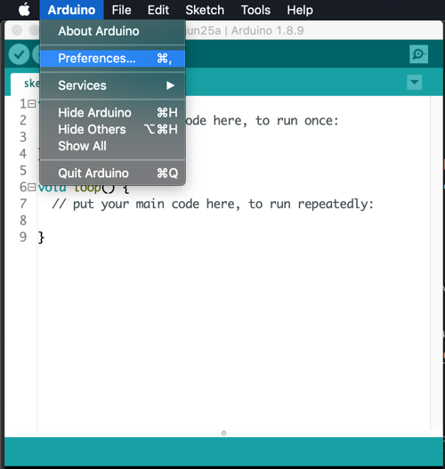
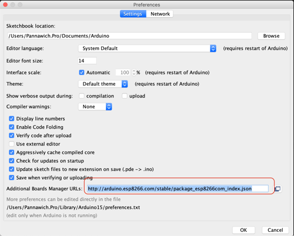
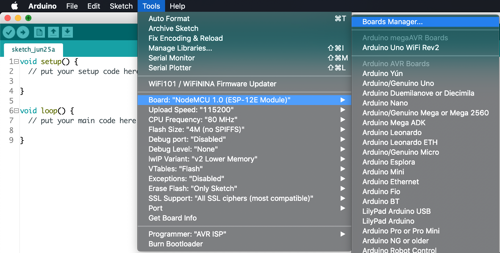
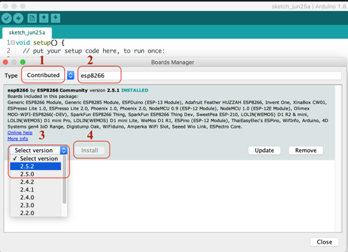
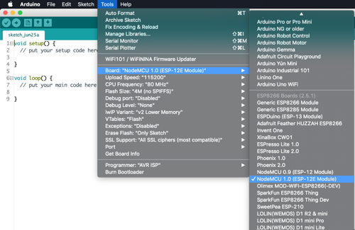

<h1>InstallCP2102</h1>
<h3>การติตั้ง Driver CP2102 สำหรับ NodeMCU V2</h3>
 
<h3>เราควรติดตั้ง Driver CP2102 ก่อน สามารถ Download ได้ตาม ลิ้งด้านล่าง</h3>
<a href="https://www.silabs.com/products/development-tools/software/usb-to-uart-bridge-vcp-drivers">Download Driver
CP2102</a>

<h3>การติดตั้ง</h3>
<h5>1. เปิด โปรแกรม Arduino IDE </h5>
<h5>2. เปิดหน้าต่าง Preferences ตามรูปด้านล่าง</h5>

<h5>3. กรอก ลิ้ง http://arduino.esp8266.com/stable/package_esp8266com_index.json ในช่องในวงสีแดงตามรูป แล้ว กด OK
</h5>

<h5>4. เลือก Menu Toll >> Board >> Boards Managers ตามรูป</h5>

<h5>5. เลือก Menu Toll >> Board >> Boards Managers ตามรูป</h5>
<ol>
<li>เลือก Type >> Contributed </li>
<li>กรอก esp8266</li>
<li>Select Version</li>
<li>กด Install</li>
</ol>

<h5>6. เลือก Menu Toll >> Board จะเห็น ชื่อ Board NodeMCU ตามรูป</h5>

เพียงเท่านี้ เราก็สามารถ เขียนโปรแกรม ด้วย Arduino IDE เชื่อมต่อกับ NodeMCU ได้แล้ว

